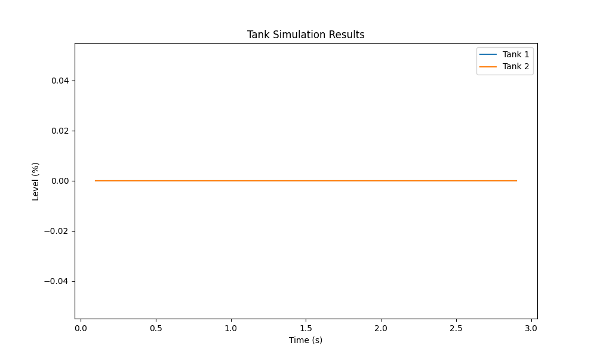

# Two-Tank System Simulation

## Description
This project simulates a two-tank system with real-time visualization and interactive controls. It models two tanks with different filling rates and control mechanisms, providing a graphical interface to observe changing water levels over time. The simulation includes features such as power loss simulation, sensor failure scenarios, and audible alarms for critical tank levels.

The system now incorporates advanced control algorithms, allowing users to select between PID (Proportional-Integral-Derivative), MPC (Model Predictive Control), and Fuzzy Logic control methods. This enhancement provides a more realistic and flexible simulation environment for studying different control strategies in fluid management systems.

## Features
- Real-time visualization of tank levels
- Interactive controls for power loss and sensor failure simulation
- Audible alarms for critical tank levels (90%, 95%, 100%)
- Fail-safe mechanisms to prevent overflow
- Customizable tank parameters and control logic
- Selectable control algorithms: PID, MPC, and Fuzzy Logic
- Data logging and export functionality

## Installation

### Prerequisites
- Python 3.7+
- PyQt5
- pyqtgraph
- numpy

### Setup
1. Clone the repository:
      git clone https://github.com/anoop6543/tanksimulation.git
2. Navigate to the project directory:
* pip install PyQt5 pyqtgraph numpy

## Usage
Run the simulation: `python TankSimulation_Live_Improved.py`

## Controls
- Select control algorithm before starting the simulation
- Start/Stop Water Flow and Drain
- Simulate Power Loss and Sensor Failure
- Stop Simulation and export data

## Visualization

## Contributing
Contributions to improve the simulation are welcome. Please follow these steps:
1. Fork the repository
2. Create a new branch (`git checkout -b feature/AmazingFeature`)
3. Commit your changes (`git commit -m 'Add some AmazingFeature'`)
4. Push to the branch (`git push origin feature/AmazingFeature`)
5. Open a Pull Request

## License
Distributed under the MIT License. See `LICENSE` for more information.

## Contact
Your Name - [@anp_ner](https://twitter.com/anp_ner_) - anoop6543@gmail.com

Project Link: [https://github.com/anoop6543/TankSimulation](https://github.com/anoop6543/TankSimulation)